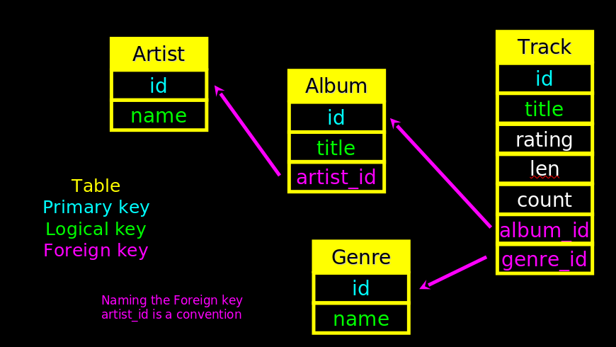
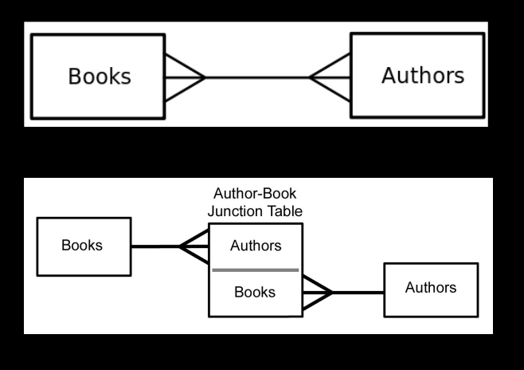
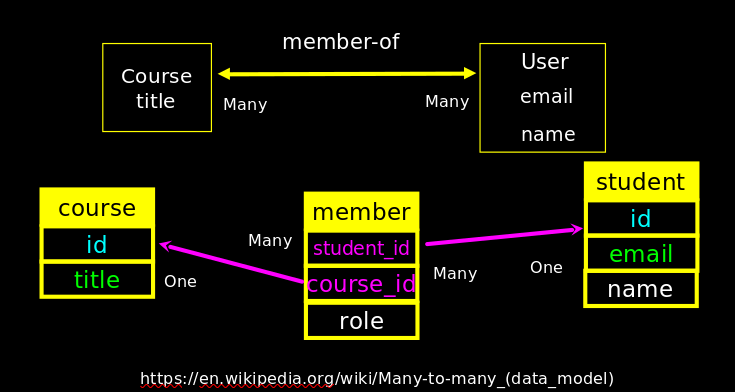
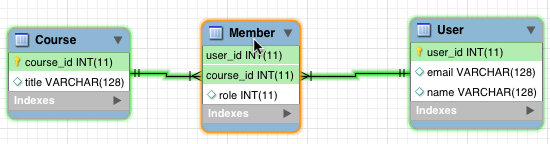

# Database Design

(<http://en.wikipedia.org/wiki/Relational_model>)

- `Database design` is an art form of its own with
  particular skills and experience.

- Our goal is to avoid the really bad mistakes and
 design clean and easily understood databases.

- Others may performance tune things later.

- Database design starts with a picture...

##   Building a Data Model

- Drawing a picture of the data objects for our application
  and then figuring out how to represent the objects and
  their relationships

- Basic Rule: Don’t put the same string data in twice -
  use a relationship instead

- When there is one thing in the “real world” there should
  only be one copy of that thing in the database

##   For each “piece of info”

- Is the column an object or an attribute of another object ?

- Once we define objects, we need to define the relationships
   between objects.

## Three Kinds of Keys

- Primary key - generally an integer auto-increment field

- Logical key - what the outside world uses for lookup

- Foreign key - generally an integer key pointing to a row in another table

## Primary Key Rules

 Best practices:

- Never use your logical key as the primary key.

- Logical keys can and do change, albeit slowly.

- Relationships that are based on matching string fields are less
  efficient than integers.

##   Foreign Keys

- A foreign key is when a table has a column containing a key that
  points to the primary key of another table.

- When all primary keys are integers, then all foreign keys are
  integers. This is good - very good.

## Normalization and Foreign Keys

- We want to keep track of which band is the “creator” of each music
  track...

- What album does this song “belong to” ?

- Which album is this song related to ?

## Database Normalization (3NF)

- There is *tons* of database theory - way too much to understand
  without excessive predicate calculus

- Do not replicate data. Instead, reference data. Point at data.

- Use integers for keys and for references.

- Add a special “key” column to each table, which you will make references to.

(<https://en.wikipedia.org/wiki/Database_normalization>)

##  Integer Reference Pattern

- We use integer columns in one table to reference (or look up) rows in another table.

## Building a Physical Data Schema



## Creating our Music Database as Root then connect to DB as user

```bash
# log as Root
sudo -u postgres psql postgres
```

then

```sql
-- [if necessary ! as Root !]
CREATE USER pg4e WITH PASSWORD '**A_____**';

# or directly
CREATE DATABASE pg4e_music WITH OWNER 'pg4e' ENCODING 'UTF8';

-- quit as Root
\q
```

```sql

CREATE TABLE artist (
  id SERIAL, 
  name VARCHAR(128) UNIQUE,
  PRIMARY KEY(id)
);


CREATE TABLE album (
  id SERIAL, 
  title VARCHAR(128) UNIQUE,
  artist_id INTEGER REFERENCES artist(id) ON DELETE CASCADE,
  PRIMARY KEY(id)
);


CREATE TABLE genre (
  id SERIAL,
  name VARCHAR(128) UNIQUE,
  PRIMARY KEY(id)
);


CREATE TABLE track (
  id SERIAL,
  title VARCHAR(128),  
  length INTEGER, 
  rating INTEGER, 
  count INTEGER,
  album_id INTEGER REFERENCES genre(id) ON DELETE CASCADE, 
  genre_id INTEGER REFERENCES album(id) ON DELETE CASCADE, 
  UNIQUE(title, album_id),
  PRIMARY KEY(id)
);


\d track -- display data about track relation/table
```

## Inserting data

```sql

-- artist
INSERT INTO artist (name) VALUES ('Led Zeppelin');
INSERT INTO artist (name) VALUES ('AC/DC');
SELECT * FROM artist;


-- album
INSERT INTO album (title, artist_id) VALUES ('Who Made Who', 2);
INSERT INTO album (title, artist_id) VALUES ('IV', 1);
SELECT * FROM album;

-- genre
INSERT INTO genre (name) VALUES ('Rock');
INSERT INTO genre (name) VALUES ('Metal');
SELECT * FROM genre;


-- track
INSERT INTO track (title, rating, length, count, album_id, genre_id)
  VALUES 
    ('Black Dog', 5, 297, 0, 2, 1),
    ('Stairway', 5, 482, 0, 2, 1) ,
    ('About to Rock', 5, 313, 0, 1, 2) ,
    ('Who Made Who', 5, 207, 0, 1, 2);

SELECT * FROM track;
```

## Using Join Across Tables: Relational Power

(<http://en.wikipedia.org/wiki/Join_(SQL)>)

- By removing the replicated data and replacing it with references to
  a single copy of each bit of data, we build a “web” of information
  that the relational database can read through very quickly - even
  for very large amounts of data.

- Often when you want some data it comes from a number of tables
  linked by these `foreign keys`.

## The JOIN Operation

- The `JOIN` operation `links across several tables` as part of a
  SELECT operation.

- You must tell the JOIN `how to use the keys` that make the
  connection between the tables using an `**ON** clause`.

```sql
-- --------------------------------------------------

SELECT
    album.title,
    artist.name
FROM
    album
    JOIN artist ON album.artist_id = artist.id;

-- --------------------------------------------------

SELECT
    album.title,
    album.artist_id,
    artist.id,
    artist.name
FROM
    album
    INNER JOIN artist ON album.artist_id = artist.id;

-- --------------------------------------------------

SELECT
    track.title,
    track.genre_id,
    genre.id,
    genre.name
FROM
    track
    CROSS JOIN genre;

-- --------------------------------------------------

SELECT
    track.title,
    genre.name
FROM
    track
    JOIN genre ON track.genre_id = genre.id;

-- --------------------------------------------------

SELECT
    track.title,
    artist.name,
    album.title,
    genre.name
FROM
    track
    JOIN genre ON track.genre_id = genre.id
    JOIN album ON track.album_id = album.id
    JOIN artist ON album.artist_id = artist.id;

-- --------------------------------------------------

SELECT
    track.title,
    artist.name,
    album.title,
    genre.name
FROM
    track
    JOIN genre ON track.genre_id = genre.id
    JOIN album ON track.album_id = album.id
    JOIN artist ON album.artist_id = artist.id;

```

##  ON DELETE CASCADE

- We are telling Postgres to "clean up" broken references

```sql
DELETE FROM Genre WHERE name = 'Metal'
```

```sh
SELECT * FROM track;
 id |     title     | len | rating | count | album_id | genre_id 
----+---------------+-----+--------+-------+----------+----------
  1 | Black Dog     | 297 |      5 |     0 |        2 |        1
  2 | Stairway      | 482 |      5 |     0 |        2 |        1
  3 | About to Rock | 313 |      5 |     0 |        1 |        2
  4 | Who Made Who  | 207 |      5 |     0 |        1 |        2
(4 rows)
```

```sh
DELETE FROM genre WHERE name='Metal';
DELETE 1
SELECT * FROM track;
 id |   title   | len | rating | count | album_id | genre_id 
----+-----------+-----+--------+-------+----------+----------
  1 | Black Dog | 297 |      5 |     0 |        2 |        1
  2 | Stairway  | 482 |      5 |     0 |        2 |        1
(2 rows)
```

## ON DELETE Choices

- `Default / RESTRICT` – Don’t allow changes that break the constraint
- `CASCADE`– Adjust child rows by removing or updating to maintain consistency
- `SET NULL` – Set the foreign key columns in the child rows to null

## Many-to-Many Relationships

- Sometimes we need to model a relationship that is many to many.
- We need to add a “connection” table with two foreign keys.
- There is usually no separate primary key.





## Start with a Fresh Database

```bash
sudo -u postgres psql postgres

# Enter password when required for root
```

```sql
postgres=# CREATE DATABASE pg4e_students_courses WITH OWNER 'pg4e';
```

```bash
psql -U pg4e pg4e_students_courses

# Enter password when required for pg4e
```

```sql
CREATE TABLE 
  student (
    id SERIAL,
    name VARCHAR(128),
    email VARCHAR(128) UNIQUE,
    PRIMARY KEY(id)
  ) ;

CREATE TABLE 
  course (
    id SERIAL,
    title VARCHAR(128) UNIQUE,
    PRIMARY KEY(id)
  ) ;


CREATE TABLE 
  member (
      student_id INTEGER REFERENCES student(id) ON DELETE CASCADE,
      course_id  INTEGER REFERENCES course(id) ON DELETE CASCADE,
      role       INTEGER,
      PRIMARY KEY (student_id, course_id)
  ) ;

--- Insert Users and Courses

INSERT INTO student (name, email) VALUES ('Jane', 'jane@tsugi.org');
INSERT INTO student (name, email) VALUES ('Ed', 'ed@tsugi.org');
INSERT INTO student (name, email) VALUES ('Sue', 'sue@tsugi.org');

SELECT * FROM student;

 id | name |     email      
----+------+----------------
  1 | Jane | jane@tsugi.org
  2 | Ed   | ed@tsugi.org
  3 | Sue  | sue@tsugi.org

-- ------------------------------------------------

INSERT INTO course (title) VALUES ('Python');
INSERT INTO course (title) VALUES ('SQL');
INSERT INTO course (title) VALUES ('PHP');

SELECT * FROM course;

 id | title  
----+--------
  1 | Python
  2 | SQL
  3 | PHP

-- ------------------------------------------------

-- Insert Memberships

INSERT INTO member (student_id, course_id, role) VALUES (1, 1, 1);
INSERT INTO member (student_id, course_id, role) VALUES (2, 1, 0);
INSERT INTO member (student_id, course_id, role) VALUES (3, 1, 0);

INSERT INTO member (student_id, course_id, role) VALUES (1, 2, 0);
INSERT INTO member (student_id, course_id, role) VALUES (2, 2, 1);

INSERT INTO member (student_id, course_id, role) VALUES (2, 3, 1);
INSERT INTO member (student_id, course_id, role) VALUES (3, 3, 0);

SELECT * FROM member;

student_id | course_id | role 
------------+-----------+------
          1 |         1 |    1
          2 |         1 |    0
          3 |         1 |    0
          1 |         2 |    0
          2 |         2 |    1
          2 |         3 |    1
          3 |         3 |    0

```

##  Joins

```sql
SELECT
    student.name,
    member.role,
    course.title
FROM
    student
    JOIN member ON member.student_id = student.id
    JOIN course ON member.course_id = course.id
ORDER BY
    course.title,
    member.role DESC,
    student.name;


 name | role | title  
------+------+--------
 Ed   |    1 | PHP
 Sue  |    0 | PHP
 Jane |    1 | Python
 Ed   |    0 | Python
 Sue  |    0 | Python
 Ed   |    1 | SQL
 Jane |    0 | SQL
(7 rows)
```



## Complexity Enables Speed

- Complexity makes speed possible and allows you to get
  very fast results as the data size grows.

- By normalizing the data and linking it with integer keys,
  the overall amount of data which the relational database
  must scan is far lower than if the data were simply flattened
  out.

- It might seem like a tradeoff - spend some time designing
  your database so it continues to be fast when your application
  is a success.

## Conclusion

- Relational databases allow to scale to very large amounts of data.

- The key is to have one copy of any data element and use relations
  and joins to link the data to multiple places.

- This greatly reduces the amount of data that must be scanned when
  doing complex operations across large amounts of data.

- Database and SQL design is a bit of an art form.
